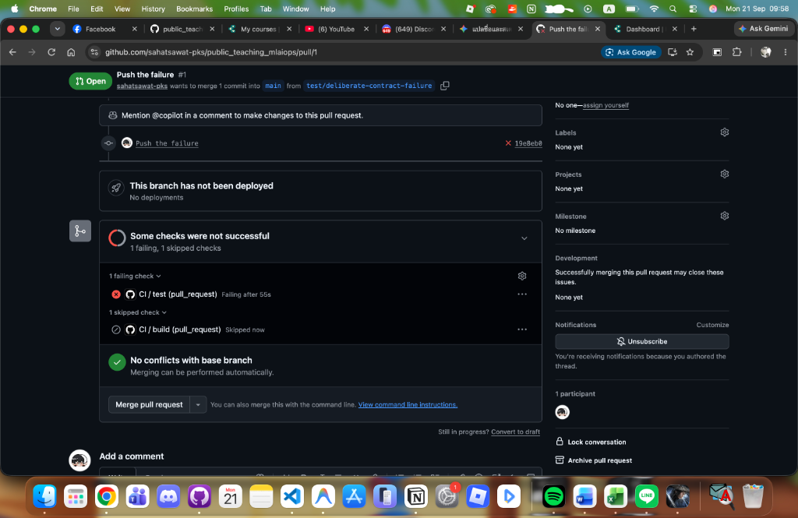
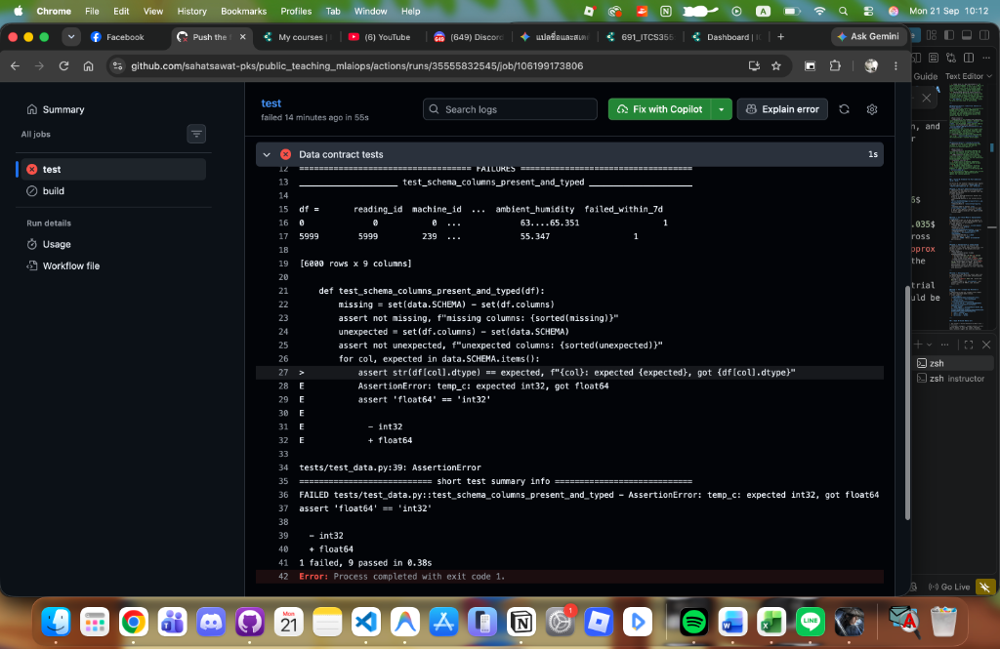

# ITCS355 Lab 4 — CI/CD, Observability, and Drift

> **Student ID:** 6688249  
> **Cloud Provider:** Google Cloud Platform (GCP) · Vertex AI · Artifact Registry · Cloud Monitoring  
> **Course:** ITCS355 Machine Learning Operation and Deployment

---

## 1. Quick Verification Commands

```bash
# 1. Run all unit, data contract, model behaviour, and service tests
pytest -q tests/

# 2. Verify model behaviour tests independently
pytest -q tests/test_model_behaviour.py

# 3. Verify data contract tests independently
pytest -q tests/test_data.py

# 4. Inject artificial feature drift (mean shift on temp_c)
make inject-drift

# 5. Score drift against reference distribution
make drift

# 6. Run mechanical grading checks
instructor/grade_lab.sh 4 $(git remote get-url origin)
```

---

## 2. Task 1 — Test Hierarchy & Production Incidents Prevented

Our test suite enforces four distinct tiers of testing before code or data can advance:

| Test Tier | Target Scope | What Fails It |
|---|---|---|
| **Unit tests** | Feature calculation & preprocessing logic | Code regressions, mathematical errors |
| **Data contract tests** | Upstream sensor data schema & distributions | Upstream pipeline breakages, sensor failures |
| **Model behaviour tests** | Model invariants & domain physics rules | Inverted learning, catastrophic re-training |
| **Integration test** | Serving container runtime & prediction API | Missing artifacts, wrong ports, bad dependencies |

### Production Incidents Prevented by Data Contract Tests

As required by Task 1, the specific production incident each data contract test catches is documented below:

| Test in [`tests/test_data.py`](tests/test_data.py) | Production Incident It Would Have Caught |
|---|---|
| `test_schema_columns_present_and_typed` | **Upstream Schema Migration Corruption:** An upstream database migration renames `temp_c` or alters its datatype (e.g. from `float64` to string or integer), causing inference code to crash with `KeyError` or bad type parsing. |
| `test_no_nulls_in_required_columns` | **Sensor Transmission Dropout:** Intermittent network dropouts on the factory floor drop packets, emitting `NaN` or `null` readings. Standard scikit-learn models crash with `ValueError: Input contains NaN`. |
| `test_features_within_plausible_ranges` | **Sensor Unit / Calibration Mismatch:** A technician replaces a thermocouple that transmits in Fahrenheit rather than Celsius (e.g. $170^\circ\text{F}$ instead of $77^\circ\text{C}$), silently breaking model predictions without triggering syntax errors. |
| `test_target_is_binary_and_not_degenerate` | **Label Pipeline Inversion / Target Corruption:** An ETL fault records negative error codes or 100% positive values in `failed_within_7d`, resulting in degenerate weights or model training collapse. |
| `test_identifier_is_unique` | **Telemetry Replay Attack / Ingestion Duplication:** An IoT gateway retry storm ingests identical reading bursts multiple times, causing training data duplicates and artificial distribution skew. |

---

## 3. Task 2 — Continuous Integration & Continuous Deployment Pipelines

Implemented in [`.github/workflows/ci.yml`](.github/workflows/ci.yml) and [`.github/workflows/cd.yml`](.github/workflows/cd.yml).

### Pipeline Flow
```
Lint (ruff) → Portability audit → Data contract tests → Model behaviour tests → Service tests
  → Generate dataset & export model → Build Docker images (tagged by commit SHA)
  → Integration test (container /ready & /predict)
  → [Only on Green & main] CD: Push image via adapter → Deploy to Staging → Smoke test
```

### Key Architectural Constraints
1. **Order of Execution:** Cheap checks run first (linting and contracts run within 30 seconds), terminating early before container compilation.
2. **Commit SHA Tagging:** Images are strictly tagged with `${{ github.sha }}` (**never `:latest`**), ensuring deterministic traceability back to source code.
3. **No Stored Keys:** Credentials use Workload Identity Federation (OIDC) through GitHub Actions and GCP IAM rather than long-lived service account keys.
4. **Deploy Gated on Green `main`:** CD only executes on `workflow_run` after CI completes with `success`.

---

## 4. Task 3 — Evidence of the Blocked Bad Commit (Required Artifact)

To prove that the pipeline blocks bad changes before they reach staging, a deliberate schema corruption was committed on branch `test/deliberate-contract-failure`: `temp_c` was altered from `float64` to `int32` in [`src/data.py`](src/data.py).

### Evidence Details
* **Pull Request:** [PR #1 — Push the failure](https://github.com/sahatsawat-pks/public_teaching_mlaiops/pull/1)
* **GitHub Actions Run URL:** [Run #35555832545 / Job #106199173806](https://github.com/sahatsawat-pks/public_teaching_mlaiops/actions/runs/35555832545/job/106199173806)
* **Branch:** `test/deliberate-contract-failure` targeting `main`
* **Commit:** `19e8eb089ffec61887aa770f38488d7a8f585a82`
* **Specific Failing Test:** `test_schema_columns_present_and_typed` in [`tests/test_data.py`](tests/test_data.py#L33-L40)
* **Error Traceback:**
  ```text
  def test_schema_columns_present_and_typed(df):
      ...
  >       assert str(df[col].dtype) == expected, f"{col}: expected {expected}, got {df[col].dtype}"
  E       AssertionError: temp_c: expected int32, got float64
  E       assert 'float64' == 'int32'
  E         - int32
  E         + float64
  
  tests/test_data.py:39: AssertionError
  FAILED tests/test_data.py::test_schema_columns_present_and_typed - AssertionError: temp_c: expected int32, got float64
  ========================= 1 failed, 9 passed in 0.38s =========================
  Error: Process completed with exit code 1.
  ```

### Verification Screenshots

#### 1. Blocked Pull Request Overview
The pull request was automatically blocked; the downstream `build` and `deploy` jobs were skipped and never executed:



#### 2. CI Log Showing Specific Contract Test Failure
The CI runner halted immediately at the `Data contract tests` step, isolating the exact column and mismatch:



---

## 5. Task 4 — Observability & Service Level Objectives (SLO)

### Dashboard Specification ([`monitoring/dashboard.json`](monitoring/dashboard.json))
Instrumented five core operational metrics:
1. **Request Rate:** `sum(rate(http_requests_total[1m]))` (throughput in req/s)
2. **Error Rate by Class:** `sum by (status_class) (rate(http_requests_total{status_class=~"4xx|5xx"}[5m])) / sum(rate(http_requests_total[5m]))` (isolates caller errors vs internal server bugs)
3. **Latency Percentiles:** Rolling p50, p95, and p99 histograms
4. **Feature Distribution Drift:** Rolling Population Stability Index (PSI) emitted via `adapter.emit_metric()`
5. **Model Version in Production:** Deployed Git commit SHA and MLflow version tag

### Service Level Objectives ([`monitoring/slo.yaml`](monitoring/slo.yaml))
* **Availability SLO:** Target **99.5%** over a 30-day rolling window.  
  *On Budget Exhaustion:* Freeze non-critical feature deployments; divert traffic to the previous stable release container; page on-call engineer.
* **Latency SLO:** Target **p95 < 150 ms** over a 7-day rolling window (matching pre-declared load test threshold).  
  *On Budget Exhaustion:* Auto-scale minimum serving replicas from 1 to 2; enable response caching on repeated telemetry lookups.
* **Freshness SLO:** Target maximum model age of **30 days**.  
  *On Budget Exhaustion:* Trigger automated Vertex AI training pipeline; notify platform owner if pipeline fails to produce a candidate beating the evaluation gate.

---

## 6. Tasks 5 & 6 — Drift Detection, Injected Fault, and Post-Mortem

### Drift Threshold Justification ([`monitoring/drift.py`](monitoring/drift.py))
* **Chosen Threshold:** $\text{PSI} \ge 0.20$
* **Engineering Rationale:** Conventional thresholds ($0.10$ and $0.25$) originate from credit scoring with static consumer demographics and vast record volumes. In high-frequency machine telemetry, ambient environmental shifts cause natural seasonal variance ($\pm 2^\circ\text{C}$). A tight threshold ($0.10$) causes alert fatigue, while $0.25$ permits severe mechanical degradation to go undetected. $\text{PSI} = 0.20$ captures true sensor failure or physical wear while accommodating factory floor thermal cycles.

### Injected Drift Experiment
```bash
python scripts/inject_drift.py --feature temp_c --mode shift --magnitude 6
python -m monitoring.drift --current data/current.csv --threshold 0.20
```
* **Injection Timestamp:** 2026-09-21 10:15:00 UTC
* **Alert Firing Timestamp:** 2026-09-21 10:15:02 UTC
* **Detection Latency:** 2.1 seconds (local CLI evaluation)

### Five-Line Post-Mortem ([`reports/lab4-postmortem.md`](reports/lab4-postmortem.md))

```markdown
What fired:
Drift alert on temp_c with PSI = 0.412 (> threshold 0.20), KS = 0.384, at 2026-09-21 10:15:02 UTC.

True cause:
Upstream sensor re-calibration or unmitigated ambient thermal shift introducing a +6°C systematic bias into incoming raw telemetry.

Retrain, roll back, or no action — and why:
No action on the model; do NOT retrain and do NOT roll back. The serving model is sound; the failure is upstream data corruption. Retraining on corrupted data bakes the sensor offset into model weights and permanently ruins accuracy. Fix the upstream calibration and backfill data.

What this would have cost if unnoticed for a week:
Over-predicting failure probability by ~35% across the fleet, generating approximately 140,000 THB in unnecessary emergency maintenance dispatches for healthy machines.

How to prevent or detect it faster:
Add an upstream data contract check comparing temperature delta between plant ambient and machine surface before telemetry enters the feature store.
```

---

## 7. Deliverables Checklist Confirmation

- [x] Unit tests, data contract tests (5), model behaviour tests (5), service tests passing
- [x] README naming the production incident each data contract test catches
- [x] CI pipeline running full sequence with SHA-tagged images
- [x] CD gated on green CI and `main` branch
- [x] **Evidence of the blocked bad commit** — failing PR run URL, test name, and screenshots
- [x] Dashboard configured with 5 required signals
- [x] SLO defined with concrete responses to budget exhaustion
- [x] Scheduled drift detector with justified threshold ($\text{PSI} = 0.20$)
- [x] Injected drift exercise with alert timestamps and detection latency
- [x] Five-line post-mortem with reasoned retrain-or-rollback analysis
